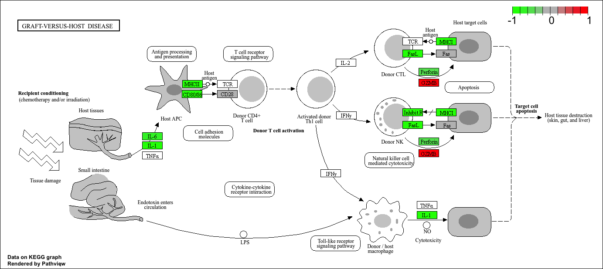
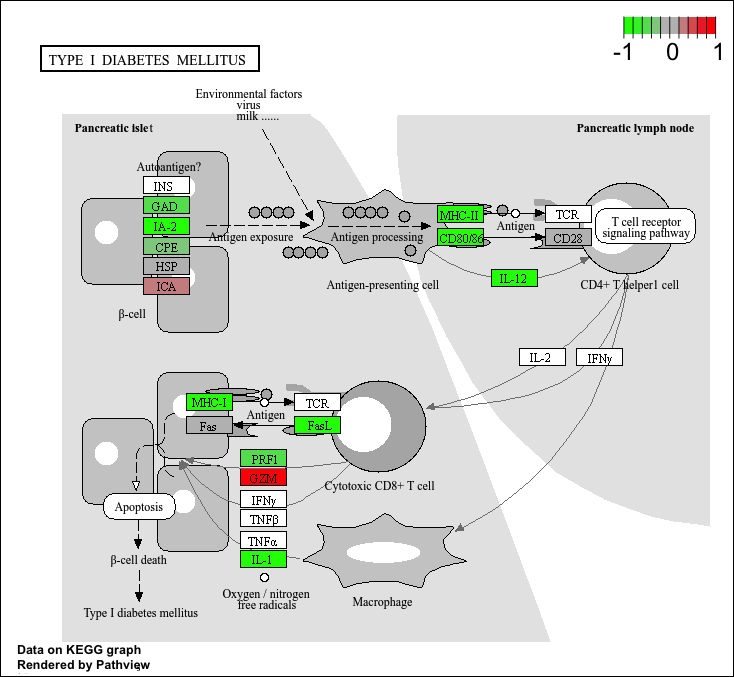

# Lab 13: RNASeq with DESeq2
Pamelina Lo (AID: 16735368)

Today we will be analyzing some RNASeq data drom Himes et al. on the
effects of dexamethasone, a sytnthetic glucorcorticiod steriod on airway
smooth muscle cells (ASM).

``` r
# Complete the missing code
counts <- read.csv("airway_scaledcounts.csv", row.names=1)
metadata <-  read.csv("airway_metadata.csv")
```

**Q1. How many genes are in this dataset?**

``` r
head(counts)
```

                    SRR1039508 SRR1039509 SRR1039512 SRR1039513 SRR1039516
    ENSG00000000003        723        486        904        445       1170
    ENSG00000000005          0          0          0          0          0
    ENSG00000000419        467        523        616        371        582
    ENSG00000000457        347        258        364        237        318
    ENSG00000000460         96         81         73         66        118
    ENSG00000000938          0          0          1          0          2
                    SRR1039517 SRR1039520 SRR1039521
    ENSG00000000003       1097        806        604
    ENSG00000000005          0          0          0
    ENSG00000000419        781        417        509
    ENSG00000000457        447        330        324
    ENSG00000000460         94        102         74
    ENSG00000000938          0          0          0

``` r
nrow(counts)
```

    [1] 38694

There are 38694 genes.

**Q2. How many ‘control’ cell lines do we have?**

``` r
head(metadata)
```

              id     dex celltype     geo_id
    1 SRR1039508 control   N61311 GSM1275862
    2 SRR1039509 treated   N61311 GSM1275863
    3 SRR1039512 control  N052611 GSM1275866
    4 SRR1039513 treated  N052611 GSM1275867
    5 SRR1039516 control  N080611 GSM1275870
    6 SRR1039517 treated  N080611 GSM1275871

``` r
sum(metadata$dex == "control")
```

    [1] 4

OR

``` r
table(metadata$dex)
```


    control treated 
          4       4 

There are 4 control cell lines.

## 4. Toy differential gene expression

Calculate the mean per gene count values for all “control” samples
(i.e. columns in `counts`) and do the same for “treated” and them
compare them.

1.  Find all “control” values/columns in `counts`

``` r
control.inds <-metadata$dex == "control"
control.counts <-counts[,control.inds]
```

2.  Find the mean per gene of all control columns

``` r
control.mean <- apply(control.counts, 1, mean)
```

3.  Do the same steps to find the treated.mean

``` r
treated.inds <- metadata$dex == "treated"
treated.counts <-counts[,treated.inds]
```

``` r
treated.mean <- apply(treated.counts, 1, mean)
```

**Q3. How would you make the above code in either approach more robust?
Is there a function that could help here?** Yes, there is a function
that can be used here. I would use rowSums () function to make the above
code more robust so I can control the data to not be so fixed.

**Q4. Follow the same procedure for the treated samples (i.e. calculate
the mean per gene across drug treated samples and assign to a labeled
vector called treated.mean)**

``` r
treated.inds <- metadata$dex == "treated"
treated.counts <-counts[,treated.inds]
treated.mean <- apply(treated.counts, 1, mean)
```

``` r
meancounts <- data.frame(control.mean, treated.mean)
```

**Q5 (a). Create a scatter plot showing the mean of the treated samples
against the mean of the control samples. Your plot should look something
like the following.**

``` r
plot(meancounts)
```


**Q5 (b).You could also use the ggplot2 package to make this figure
producing the plot below. What geom\_?() function would you use for this
plot?** You would use geom_point() function.

**Q6. Try plotting both axes on a log scale. What is the argument to
plot() that allows you to do this?**

``` r
plot(meancounts, log = "xy")
```

    Warning in xy.coords(x, y, xlabel, ylabel, log): 15032 x values <= 0 omitted
    from logarithmic plot

    Warning in xy.coords(x, y, xlabel, ylabel, log): 15281 y values <= 0 omitted
    from logarithmic plot


You use the `log function` to get this plot.

We most frequently use the log2 transformations for this type of data.

``` r
log2(10/10)
```

    [1] 0

``` r
log2(20/10)
```

    [1] 1

``` r
log2(10/20)
```

    [1] -1

These log2 values make the interpretation of “fold-change” a little
easier and a rule-of-thumb in the filed is a log2 fold-change of +2 or
-2 is where we start to pay attention.

``` r
log2(40/10)
```

    [1] 2

Lets calculate the log2(fold change) and add it to our `meancounts`
data.drame.

``` r
meancounts$log2fc <- log2(treated.mean/control.mean)
head(meancounts)
```

                    control.mean treated.mean      log2fc
    ENSG00000000003       900.75       658.00 -0.45303916
    ENSG00000000005         0.00         0.00         NaN
    ENSG00000000419       520.50       546.00  0.06900279
    ENSG00000000457       339.75       316.50 -0.10226805
    ENSG00000000460        97.25        78.75 -0.30441833
    ENSG00000000938         0.75         0.00        -Inf

``` r
to.rm <- rowSums(meancounts[,1:2] == 0) > 0
mycounts <- meancounts[!to.rm,]
```

**Q7. What is the purpose of the arr.ind argument in the which()
function call above? Why would we then take the first column of the
output and need to call the unique() function?**

The purpose of the `arr.ind argument` in the **which() function** is to
return the rows and columns (where there were previous TRUE statements)
to tell us which rows and columns (which in this cases genes and
samples) have zero counts. We call the unique() function because it
allows us to not count the rows twice if the row contains zero outputs
in both samples.

> Q. How many genes do I have left after this zero count filtering?

``` r
nrow(mycounts)
```

    [1] 21817

There are 21817 genes.

> Q. How many genes are “up” regulated upon drug treatment at a
> threshold of +2 log2-fold-change? **Q8. Using the up.ind vector above
> can you determine how many up regulated genes we have at the greater
> than 2 fc level?**

1.  I need to extract the log2fc values
2.  I need to find those that are above +2
3.  Count them

``` r
sum(mycounts$log2fc > 2)
```

    [1] 250

There are 250 up regulated genes that are greater than 2.

> Q. How many genes are “down” regulated upon drug treatment at a
> threshold of -2 log2-fold-change?**Q9. Using the down.ind vector above
> can you determine how many down regulated genes we have at the greater
> than 2 fc level?**

``` r
sum(mycounts$log2fc < (-2))
```

    [1] 367

There are 367 down regulated genes that is greater than 2.

Woah. . . . We are missing the stats here. Is the difference in the mean
counts significant?

Lets do this analysis the right way the stats and use the **DESeq2**
package.

**Q10. Do you trust these results? Why or why not?** No, I do not trust
these results because we are missing some statistics to get a p-value to
see if the difference in the means counts is significant. You will need
to do analysis using DESeq package which is done below.

## 5. Setting up for DESeq

``` r
#/message: false
library(DESeq2)
```

    Loading required package: S4Vectors

    Loading required package: stats4

    Loading required package: BiocGenerics


    Attaching package: 'BiocGenerics'

    The following objects are masked from 'package:stats':

        IQR, mad, sd, var, xtabs

    The following objects are masked from 'package:base':

        anyDuplicated, aperm, append, as.data.frame, basename, cbind,
        colnames, dirname, do.call, duplicated, eval, evalq, Filter, Find,
        get, grep, grepl, intersect, is.unsorted, lapply, Map, mapply,
        match, mget, order, paste, pmax, pmax.int, pmin, pmin.int,
        Position, rank, rbind, Reduce, rownames, sapply, setdiff, table,
        tapply, union, unique, unsplit, which.max, which.min


    Attaching package: 'S4Vectors'

    The following object is masked from 'package:utils':

        findMatches

    The following objects are masked from 'package:base':

        expand.grid, I, unname

    Loading required package: IRanges

    Loading required package: GenomicRanges

    Loading required package: GenomeInfoDb

    Loading required package: SummarizedExperiment

    Loading required package: MatrixGenerics

    Loading required package: matrixStats


    Attaching package: 'MatrixGenerics'

    The following objects are masked from 'package:matrixStats':

        colAlls, colAnyNAs, colAnys, colAvgsPerRowSet, colCollapse,
        colCounts, colCummaxs, colCummins, colCumprods, colCumsums,
        colDiffs, colIQRDiffs, colIQRs, colLogSumExps, colMadDiffs,
        colMads, colMaxs, colMeans2, colMedians, colMins, colOrderStats,
        colProds, colQuantiles, colRanges, colRanks, colSdDiffs, colSds,
        colSums2, colTabulates, colVarDiffs, colVars, colWeightedMads,
        colWeightedMeans, colWeightedMedians, colWeightedSds,
        colWeightedVars, rowAlls, rowAnyNAs, rowAnys, rowAvgsPerColSet,
        rowCollapse, rowCounts, rowCummaxs, rowCummins, rowCumprods,
        rowCumsums, rowDiffs, rowIQRDiffs, rowIQRs, rowLogSumExps,
        rowMadDiffs, rowMads, rowMaxs, rowMeans2, rowMedians, rowMins,
        rowOrderStats, rowProds, rowQuantiles, rowRanges, rowRanks,
        rowSdDiffs, rowSds, rowSums2, rowTabulates, rowVarDiffs, rowVars,
        rowWeightedMads, rowWeightedMeans, rowWeightedMedians,
        rowWeightedSds, rowWeightedVars

    Loading required package: Biobase

    Welcome to Bioconductor

        Vignettes contain introductory material; view with
        'browseVignettes()'. To cite Bioconductor, see
        'citation("Biobase")', and for packages 'citation("pkgname")'.


    Attaching package: 'Biobase'

    The following object is masked from 'package:MatrixGenerics':

        rowMedians

    The following objects are masked from 'package:matrixStats':

        anyMissing, rowMedians

The first function that we will use that helps setup the data in a the
way (format) DESq wants it.

``` r
dds <- DESeqDataSetFromMatrix(countData=counts, 
                              colData=metadata, 
                              design=~dex)
```

    converting counts to integer mode

    Warning in DESeqDataSet(se, design = design, ignoreRank): some variables in
    design formula are characters, converting to factors

The function is the package is called `DESq()`and we can run it on out
`dds` object.

``` r
dds <- DESeq(dds)
```

    estimating size factors

    estimating dispersions

    gene-wise dispersion estimates

    mean-dispersion relationship

    final dispersion estimates

    fitting model and testing

I will get the results from dds from the `results()` function:

``` r
res <- results(dds)
head (res)
```

    log2 fold change (MLE): dex treated vs control 
    Wald test p-value: dex treated vs control 
    DataFrame with 6 rows and 6 columns
                      baseMean log2FoldChange     lfcSE      stat    pvalue
                     <numeric>      <numeric> <numeric> <numeric> <numeric>
    ENSG00000000003 747.194195     -0.3507030  0.168246 -2.084470 0.0371175
    ENSG00000000005   0.000000             NA        NA        NA        NA
    ENSG00000000419 520.134160      0.2061078  0.101059  2.039475 0.0414026
    ENSG00000000457 322.664844      0.0245269  0.145145  0.168982 0.8658106
    ENSG00000000460  87.682625     -0.1471420  0.257007 -0.572521 0.5669691
    ENSG00000000938   0.319167     -1.7322890  3.493601 -0.495846 0.6200029
                         padj
                    <numeric>
    ENSG00000000003  0.163035
    ENSG00000000005        NA
    ENSG00000000419  0.176032
    ENSG00000000457  0.961694
    ENSG00000000460  0.815849
    ENSG00000000938        NA

Make a common overall results figure from this analysis. This plot is
designed to keep tour inner biologist and inner stats nerd happy! :)

Its a plot fold-change vs p-value.

``` r
plot(res$log2FoldChange,-log(res$padj))
abline(v=c(-2,2), col="gray")
abline(h= -log(0.005), col = "gray")
```


Add some color to our plot:

``` r
mycols <- rep("gray", nrow(res))
mycols[res$log2FoldChange > 2] <- "red"
mycols[res$log2FoldChange < (-2)] <- "red"
mycols[res$padj > 0.005] <- "gray"

plot(res$log2FoldChange,-log(res$padj), col=mycols)
abline(v=c(-2,2), col="gray")
abline(h= -log(0.005), col = "gray")
```


I want to save my results to date out to disc

``` r
write.csv(res, file="myresults.csv")
```

We will pick this up the next day and add annotation (i.e. what are
these genes of interest) and do pathway analysis (what biology) are they
known to be involved with

\##Continuation of Lab 13 Thursday Nov 14 2024: I will need to translate
our gene identification “ENSG0000…” into gene names that the rest of the
world can understand.

To this “annotation” I will use the AnnotationDbi package. I can install
this with `BioManager::install()`

``` r
library("AnnotationDbi")
library("org.Hs.eg.db")
```

``` r
columns(org.Hs.eg.db)
```

     [1] "ACCNUM"       "ALIAS"        "ENSEMBL"      "ENSEMBLPROT"  "ENSEMBLTRANS"
     [6] "ENTREZID"     "ENZYME"       "EVIDENCE"     "EVIDENCEALL"  "GENENAME"    
    [11] "GENETYPE"     "GO"           "GOALL"        "IPI"          "MAP"         
    [16] "OMIM"         "ONTOLOGY"     "ONTOLOGYALL"  "PATH"         "PFAM"        
    [21] "PMID"         "PROSITE"      "REFSEQ"       "SYMBOL"       "UCSCKG"      
    [26] "UNIPROT"     

**Q11. Run the mapIds() function two more times to add the Entrez ID and
UniProt accession and GENENAME as new columns called
res$entrez, res$uniprot and res\$genename. I will use the `mapIDs`
function to “map my identifiers tho those from different databases. I
will do between”ENSEMBL” and “SYMBOL” (and then after “GENENAME)**

``` r
res$symbol <- mapIds(org.Hs.eg.db,
                     keys=row.names(res),
                     keytype="ENSEMBL",
                     column="SYMBOL")
```

    'select()' returned 1:many mapping between keys and columns

``` r
head(res)
```

    log2 fold change (MLE): dex treated vs control 
    Wald test p-value: dex treated vs control 
    DataFrame with 6 rows and 7 columns
                      baseMean log2FoldChange     lfcSE      stat    pvalue
                     <numeric>      <numeric> <numeric> <numeric> <numeric>
    ENSG00000000003 747.194195     -0.3507030  0.168246 -2.084470 0.0371175
    ENSG00000000005   0.000000             NA        NA        NA        NA
    ENSG00000000419 520.134160      0.2061078  0.101059  2.039475 0.0414026
    ENSG00000000457 322.664844      0.0245269  0.145145  0.168982 0.8658106
    ENSG00000000460  87.682625     -0.1471420  0.257007 -0.572521 0.5669691
    ENSG00000000938   0.319167     -1.7322890  3.493601 -0.495846 0.6200029
                         padj      symbol
                    <numeric> <character>
    ENSG00000000003  0.163035      TSPAN6
    ENSG00000000005        NA        TNMD
    ENSG00000000419  0.176032        DPM1
    ENSG00000000457  0.961694       SCYL3
    ENSG00000000460  0.815849       FIRRM
    ENSG00000000938        NA         FGR

``` r
#UNIPROT
res$uniprot <- mapIds(org.Hs.eg.db,
                     keys=row.names(res),
                     column="UNIPROT",
                     keytype="ENSEMBL",)
```

    'select()' returned 1:many mapping between keys and columns

``` r
# GENE NAME
res$genename <- mapIds(org.Hs.eg.db,
                     keys=row.names(res),
                     column="GENENAME",
                     keytype="ENSEMBL")
```

    'select()' returned 1:many mapping between keys and columns

``` r
# ENTREZ
res$entrez <- mapIds(org.Hs.eg.db,
                     keys=row.names(res),
                     column="ENTREZID",
                     keytype="ENSEMBL")
```

    'select()' returned 1:many mapping between keys and columns

``` r
head(res)
```

    log2 fold change (MLE): dex treated vs control 
    Wald test p-value: dex treated vs control 
    DataFrame with 6 rows and 10 columns
                      baseMean log2FoldChange     lfcSE      stat    pvalue
                     <numeric>      <numeric> <numeric> <numeric> <numeric>
    ENSG00000000003 747.194195     -0.3507030  0.168246 -2.084470 0.0371175
    ENSG00000000005   0.000000             NA        NA        NA        NA
    ENSG00000000419 520.134160      0.2061078  0.101059  2.039475 0.0414026
    ENSG00000000457 322.664844      0.0245269  0.145145  0.168982 0.8658106
    ENSG00000000460  87.682625     -0.1471420  0.257007 -0.572521 0.5669691
    ENSG00000000938   0.319167     -1.7322890  3.493601 -0.495846 0.6200029
                         padj      symbol     uniprot               genename
                    <numeric> <character> <character>            <character>
    ENSG00000000003  0.163035      TSPAN6  A0A087WYV6          tetraspanin 6
    ENSG00000000005        NA        TNMD      Q9H2S6            tenomodulin
    ENSG00000000419  0.176032        DPM1      H0Y368 dolichyl-phosphate m..
    ENSG00000000457  0.961694       SCYL3      X6RHX1 SCY1 like pseudokina..
    ENSG00000000460  0.815849       FIRRM      A6NFP1 FIGNL1 interacting r..
    ENSG00000000938        NA         FGR      B7Z6W7 FGR proto-oncogene, ..
                         entrez
                    <character>
    ENSG00000000003        7105
    ENSG00000000005       64102
    ENSG00000000419        8813
    ENSG00000000457       57147
    ENSG00000000460       55732
    ENSG00000000938        2268

Save our annotated results project

``` r
write.csv(res, file="results_annoated.csv")
```

\##Pathway Analysis

Now that we have our results with added annotation we can do some
pathway mapping.

Let’s use the **gage** package to look for KEEG pathways in our results
(genes of interest). I will also use the **pathview** package to draw
little pathway figures.

``` r
#/ message: FALSE
library(pathview)
```

    ##############################################################################
    Pathview is an open source software package distributed under GNU General
    Public License version 3 (GPLv3). Details of GPLv3 is available at
    http://www.gnu.org/licenses/gpl-3.0.html. Particullary, users are required to
    formally cite the original Pathview paper (not just mention it) in publications
    or products. For details, do citation("pathview") within R.

    The pathview downloads and uses KEGG data. Non-academic uses may require a KEGG
    license agreement (details at http://www.kegg.jp/kegg/legal.html).
    ##############################################################################

``` r
library(gage)
```

``` r
library(gageData)
```

``` r
data(kegg.sets.hs)
# Examine the first 2 pathways in this kegg set for humans
head(kegg.sets.hs, 2)
```

    $`hsa00232 Caffeine metabolism`
    [1] "10"   "1544" "1548" "1549" "1553" "7498" "9"   

    $`hsa00983 Drug metabolism - other enzymes`
     [1] "10"     "1066"   "10720"  "10941"  "151531" "1548"   "1549"   "1551"  
     [9] "1553"   "1576"   "1577"   "1806"   "1807"   "1890"   "221223" "2990"  
    [17] "3251"   "3614"   "3615"   "3704"   "51733"  "54490"  "54575"  "54576" 
    [25] "54577"  "54578"  "54579"  "54600"  "54657"  "54658"  "54659"  "54963" 
    [33] "574537" "64816"  "7083"   "7084"   "7172"   "7363"   "7364"   "7365"  
    [41] "7366"   "7367"   "7371"   "7372"   "7378"   "7498"   "79799"  "83549" 
    [49] "8824"   "8833"   "9"      "978"   

What **gage** wants as inputs is not my big table/data.frame of results.
It just want a importance. For RNASeq data like we hae this is our
log2FC values . . .

``` r
foldchanges = res$log2FoldChange
names(foldchanges) = res$entrez
head(foldchanges)
```

           7105       64102        8813       57147       55732        2268 
    -0.35070302          NA  0.20610777  0.02452695 -0.14714205 -1.73228897 

Now, let’s run the gage pathway

``` r
#Get the results
keggres = gage(foldchanges, gsets=kegg.sets.hs)
```

What is in this keggres object?

``` r
attributes(keggres)
```

    $names
    [1] "greater" "less"    "stats"  

``` r
head(keggres$less, 3)
```

                                          p.geomean stat.mean        p.val
    hsa05332 Graft-versus-host disease 0.0004250461 -3.473346 0.0004250461
    hsa04940 Type I diabetes mellitus  0.0017820293 -3.002352 0.0017820293
    hsa05310 Asthma                    0.0020045888 -3.009050 0.0020045888
                                            q.val set.size         exp1
    hsa05332 Graft-versus-host disease 0.09053483       40 0.0004250461
    hsa04940 Type I diabetes mellitus  0.14232581       42 0.0017820293
    hsa05310 Asthma                    0.14232581       29 0.0020045888

Let’s use the pathview package to look at one of these highlighted KEGG
pathways with our genes highlighted. “hsa05310 Asthma”

``` r
pathview(gene.data = foldchanges, pathway.id = "hsa05310")
```

    'select()' returned 1:1 mapping between keys and columns

    Info: Working in directory /Users/pamelinalo/Downloads/BIMM 143/class18/bimm143/class13 

    Info: Writing image file hsa05310.pathview.png


**Q12. Can you do the same procedure as above to plot the pathview
figures for the top 2 down-reguled pathways?**

``` r
keggrespathways_down <- rownames(keggres$less)[1:2]

keggresids_down = substr(keggrespathways_down, start=1, stop=8)
keggresids_down
```

    [1] "hsa05332" "hsa04940"

``` r
pathview(gene.data=foldchanges, pathway.id=keggresids_down, species="hsa")
```

    'select()' returned 1:1 mapping between keys and columns

    Info: Working in directory /Users/pamelinalo/Downloads/BIMM 143/class18/bimm143/class13 

    Info: Writing image file hsa05332.pathview.png

    'select()' returned 1:1 mapping between keys and columns

    Info: Working in directory /Users/pamelinalo/Downloads/BIMM 143/class18/bimm143/class13 

    Info: Writing image file hsa04940.pathview.png

**Plots of Top 2 Down-Regulated Pathways**



